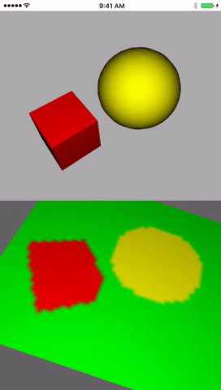
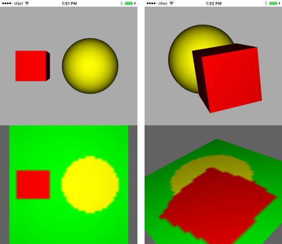

# SceneKitOffscreenRendering
Quick example using a `SCNRenderer` and Metal to render a scene offscreen to a `MTLTexture` that's then displayed in another scene. Much like Portal (the game), well kind of.

The rendered image displayed as a texture in the bottom `SCNView` is quite pixelated due to using a small texture size, there's no problem bumping this up.

Interesting parts are found in the `doRender` function, with boilerplate code in the `setupMetal` and `setupTexture` functions. As the code shows, this was rather trivial to setup.

## License
MIT
